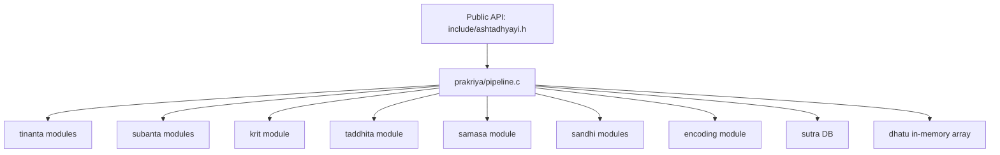
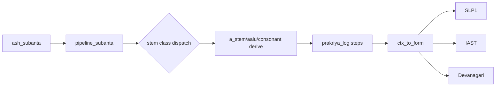
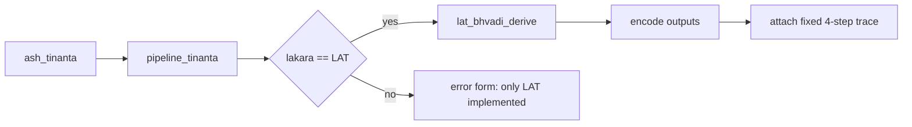

# 04 — Architecture and System Design (System Blueprint)

This chapter reverse-engineers the concrete repository architecture and runtime dataflow.

Companion chapters:
- Rule semantics: [05_The_Paninian_Rule_Engine.md](05_The_Paninian_Rule_Engine.md)
- Derivation lifecycle: [06_State_Context_and_Execution_Pipeline.md](06_State_Context_and_Execution_Pipeline.md)

---

## 1) High-level architecture

The system is built as a **C17 static library** (`ashtadhyayi`) with:

- Public API in `include/ashtadhyayi.h`.
- Domain modules under `core/`, `prakriya/`, `sandhi/`, `samasa/`, `ancillary/`, `encoding/`.
- Demo client in `examples/demo.c`.
- Unit tests auto-discovered from `tests/unit/test_*.c`.

The build graph is declared in `CMakeLists.txt` and wrapped by `Makefile`.

---

## 2) Workspace directory tree (architecture-oriented)

```text
/workspace
├── include/                  # Public API boundary (ASH_* / ash_*)
├── encoding/                 # SLP1 <-> IAST/Devanagari/HK
├── core/
│   ├── phonology/            # varna + pratyahara engines
│   ├── sutrapatha/           # sutra TSV loader and lookup indices
│   ├── metadata/             # samjna/anubandha/adhikara/anuvrtti/paribhasha
│   └── conflict/             # candidate ranking + precedence
├── ancillary/
│   ├── dhatupatha/           # dhatu TSV loader
│   ├── ganapatha/            # gana TSV loader
│   └── unadipatha/           # unadi TSV loader + form adapter
├── prakriya/
│   ├── tinanta/              # lakara/ting/vikarana/lat derivation
│   ├── subanta/              # sup + stem-class derivation modules
│   ├── krit/                 # krt derivation logic
│   ├── taddhita/             # taddhita derivation logic
│   ├── context.*             # derivation state + step logging
│   ├── term.*                # term object + substitutions
│   └── pipeline.*            # API wrappers + orchestration + bootstrapping
├── sandhi/                   # vowel / hal / visarga sandhi
├── samasa/                   # compound derivation
├── tools/                    # ingestion, oracle validation, coverage report
├── data/                     # generated TSV datasets
├── tests/                    # unit + regression artifacts
└── examples/                 # demo executable entrypoint
```

---

## 3) Bootstrapping phase (Upadeśa to in-memory state)

### 3.1 Boot sequence

1. Client calls `ash_db_load(data_dir)`.
2. `ash_db_load()` allocates `ASH_DB` and invokes `pipeline_init()`.
3. `pipeline_init()` loads:
   - `sutras.tsv` into `Pipeline.sutras` via `sutra_db_load()`.
   - `dhatupatha.tsv` into a temporary `DhatupathaDB`, then copies rows into `Pipeline.dhatus`.
4. Temporary loader DB is freed; runtime `Pipeline` retains copied entries.

### 3.2 Bootstrapping mermaid flow

```mermaid
flowchart LR
  A[Client: ash_db_load(data_dir)] --> B[pipeline_init]
  B --> C[sutra_db_load data_dir/sutras.tsv]
  B --> D[dhatupatha_db_load data_dir/dhatupatha.tsv]
  D --> E[Copy to Pipeline.dhatus]
  E --> F[dhatupatha_db_free temporary DB]
  C --> G[Pipeline ready]
  F --> G
```

---

## 4) Runtime module interaction

### 4.1 API orchestration map



### 4.2 Dataflow: subanta path (ctx-driven)



### 4.3 Dataflow: tinanta LAT path



---

## 5) Architectural characteristics

### 5.1 Strong points

- Clean API boundary with opaque DB handle.
- Clear module decomposition by linguistic domain.
- Explicit trace data structures (`ASH_PrakriyaStep` / `PrakriyaStep`).
- Deterministic table/procedure-driven transforms.

### 5.2 Current architectural shape

- Hybrid engine:
  - metadata/conflict infrastructure exists,
  - but many derivations are specialized procedural paths instead of one universal rule scheduler.
- TSV corpora are authoritative for loaded datasets; some logic remains encoded as static C tables.

---

## 6) Navigation pointers

- Boot and orchestration internals: [06_State_Context_and_Execution_Pipeline.md](06_State_Context_and_Execution_Pipeline.md)
- Rule and precedence semantics: [05_The_Paninian_Rule_Engine.md](05_The_Paninian_Rule_Engine.md)
- Data and complexity details: [07_Data_Structures_Memory_and_Performance.md](07_Data_Structures_Memory_and_Performance.md)

---

🔙 Back to TOC: [Master Table of Contents](01_README_Vision_and_Value.md#master-table-of-contents)
