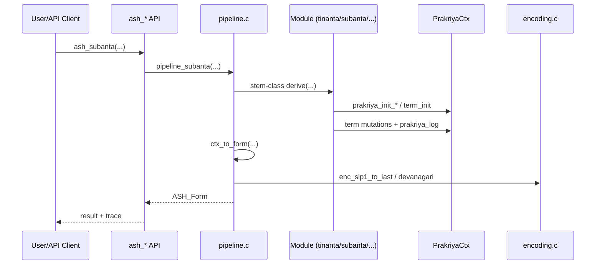

# 06 — State, Context, and Execution Pipeline (Derivation Loop)

This chapter traces runtime state and lifecycle from API call to emitted form.

Related:
- Rule semantics: [05_The_Paninian_Rule_Engine.md](05_The_Paninian_Rule_Engine.md)
- System architecture: [04_Architecture_and_System_Design.md](04_Architecture_and_System_Design.md)

---

## 1) Core state objects

### 1.1 `Term` (micro-state unit)

`Term` stores:

- `value` (current transformed text),
- `upadesa` (original source string),
- `samjna` bitmask,
- `it_flags`,
- per-term `rule_history`,
- flags/index metadata.

This is the mutable unit used inside `PrakriyaCtx`.

### 1.2 `PrakriyaCtx` (macro derivation state)

`PrakriyaCtx` stores:

- bounded term array (`terms[MAX_TERMS]`),
- grammatical selectors (lakara/purusha/vacana/pada/linga/vibhakti/gana),
- bounded step log (`steps[MAX_PRAKRIYA_STEPS]`),
- error channel (`error`, `error_msg`).

---

## 2) Anuvṛtti as context carry-over in this codebase

Two levels exist:

1. **Operational carry-over** inside derivation code:
   - context fields in `PrakriyaCtx` persist across step functions,
   - `Term` states are mutated incrementally.
2. **Sūtra-level metadata carry-over**:
   - `AnuvrttiDB` seeded records in `core/metadata/anuvrtti.c`,
   - query functions (`anuvrtti_get`, `anuvrtti_resolve`).

Current implementation uses (1) directly for runtime derivation; (2) exists as metadata support and tests.

---

## 3) Step logging and trace mechanics

### 3.1 Internal logger

`prakriya_log(ctx, sutra_id, desc)` appends one `PrakriyaStep`.

Captured fields:

- `sutra_id`,
- `description`,
- `form_before`,
- `form_after`.

### 3.2 Public trace

`ASH_Form` exposes `steps` and `step_count`, and public printer:

- `ash_form_print_prakriya()`.

`ctx_to_form()` copies internal steps into API-visible `ASH_PrakriyaStep` rows.

---

## 4) End-to-end lifecycle by entrypoint

### 4.1 Tinanta (`ash_tinanta`)

1. API wrapper validates DB and forwards to `pipeline_tinanta`.
2. Empty-root check.
3. Lakāra gate (`LAT` only).
4. `lat_bhvadi_derive()` builds output string.
5. Output encodings generated.
6. Step trace allocated with fixed four entries and sutra IDs.
7. `ASH_Form` returned.

### 4.2 Subanta (`ash_subanta`)

1. API wrapper forwards to `pipeline_subanta`.
2. Empty-stem check and normalization (`rAma` -> `rAm` special case).
3. Stem-class dispatch to matching derive function.
4. Derive function initializes `PrakriyaCtx`, appends suffix where needed, mutates term values, logs rule steps.
5. `ctx_to_form()` emits final SLP1 + IAST + Devanāgarī + copied steps.

### 4.3 Kṛt/Taddhita/Samāsa

- Kṛt and taddhita use their own context-backed sequences and then package `ASH_Form`.
- Samāsa joins two members, applies type-specific post-processing, and logs one step.

---

## 5) Pipeline sequence diagram

---

## 6) Mutation model and determinism

- State mutation is explicit and in-place on bounded arrays.
- No background scheduler/threading in derivation paths.
- Call order determines final form.
- Most branches are deterministic single-output paths.

---

## 7) Error propagation

Pattern:

- modules return `bool` or error-form,
- wrappers convert invalid state to `ASH_Form.valid = false` with message,
- callers inspect `valid` and consume `error`.

---

## 8) Practical debugging hooks

- Print structured trace: `ash_form_print_prakriya`.
- Use module tests in `tests/unit/` for targeted branch behavior.
- Use `examples/demo.c` CLI for quick path invocation (`tinanta`, `subanta`).

For full testing strategy see [09_Testing_Validation_and_Debugging.md](09_Testing_Validation_and_Debugging.md).

---

🔙 Back to TOC: [Master Table of Contents](01_README_Vision_and_Value.md#master-table-of-contents)
